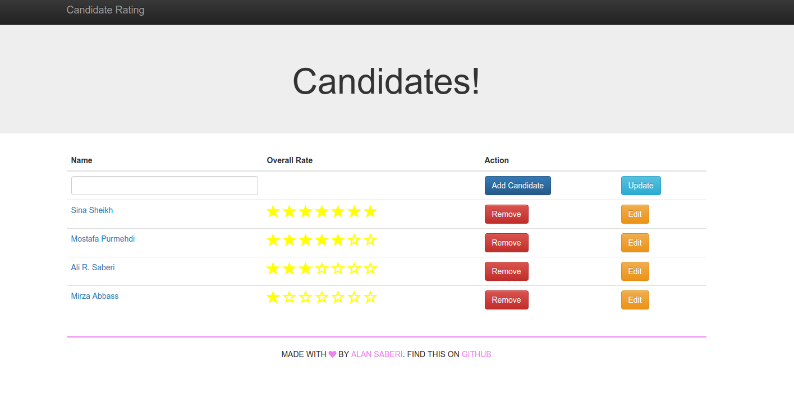
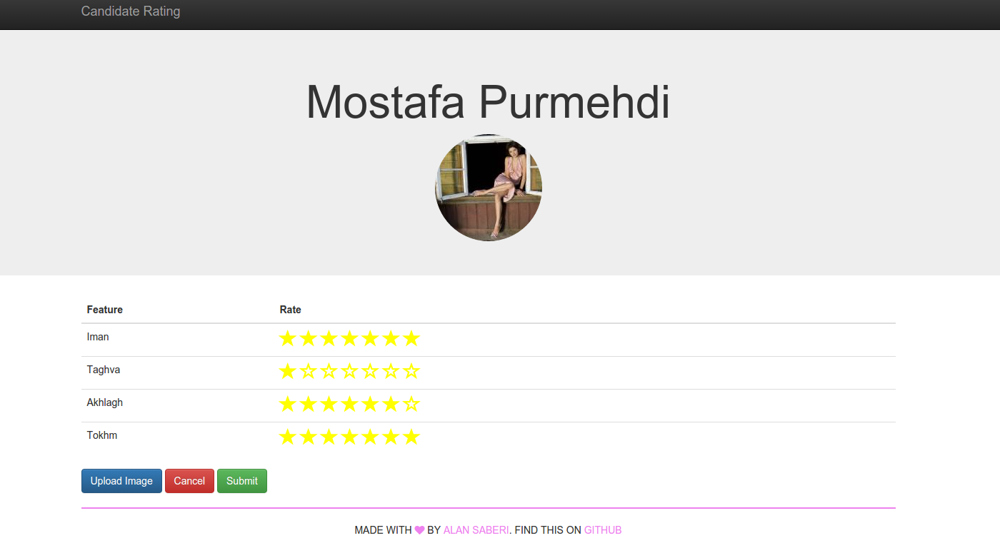

# Rating
A simple rating, voting app initially asked by a friend in business school for internal usage.

You can add, edit, remove, update and vote for each candiates based on four factors of Iman, Taghva, Akhlagh, and Tokhm!:scream:

## Demo

## APIs and technologies
- HTML5, CSS, JS, [Bootstrap](http://getbootstrap.com/)
- [AngularJS](https://angularjs.org/)
- [UI-bootstrap](https://angular-ui.github.io/bootstrap/)
- [NodeJS](https://nodejs.org/en/)
- [Express](http://expressjs.com/)
- [MongoDB](https://www.mongodb.org/)

## How to make it work on your machine (To Mostafa)
- Download ZIP
- You have to be able to install Nodejs on your windows machine globally.(follow the instruction [here](https://nodejs.org/en/download/)). It comes with npm.
- You have be be able to install MongoDB in you machine.(follow the instruction [here](http://docs.mongodb.org/v3.0/tutorial/install-mongodb-on-windows/))
- Fire MongoDB servive on the other folder tht you made and make a database document named `candidateList` nad just leave it like that. instruction is [here](https://www.youtube.com/watch?v=oVIeMfvgTz8)
- Go to the folder that you have downloaded project. You see `server.js` and `package.json` files here by comaand lines via `CMD`
- Type in this  folder `npm install` which  installs all of the required dependencies for the front-end and back-end
- Type `bower install` which installs some more dependencies.
- Type `node server.js` which runs the server file and pushes all of the files to you localhost in browser.
- Prefably use Chrome now. and type `localhost:8000` in url. You will see the the home page of your project.
- You dont have candidates now, but you can start adding them.  Remember that all of these candiate are only on your local machine.
- I have to update uploading image module later, which I had some difficulty making it last night,
- I will modify more after these interviews.
